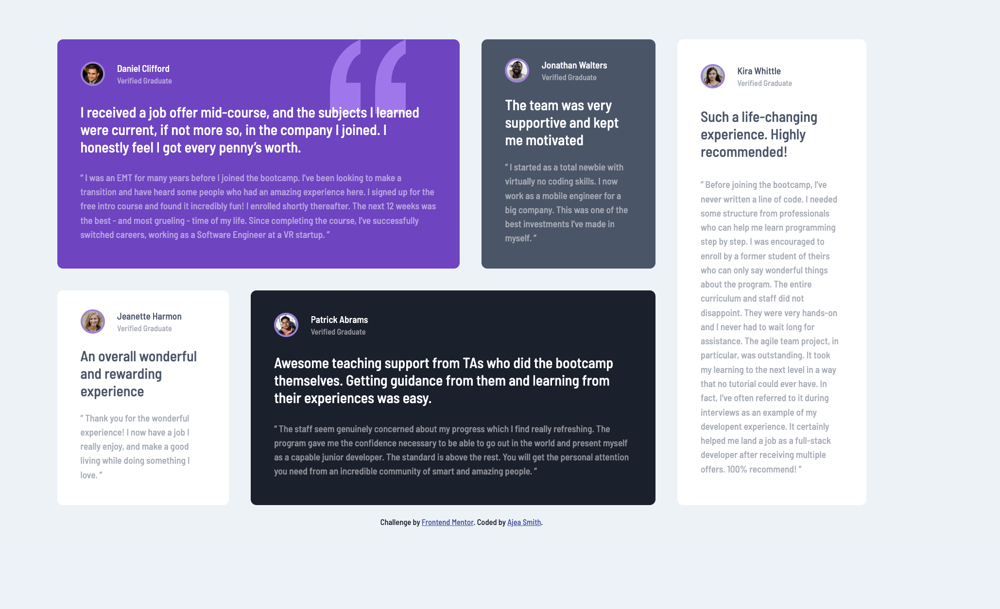

# Frontend Mentor - Testimonials grid section solution

This is a solution to the [Testimonials grid section challenge on Frontend Mentor](https://www.frontendmentor.io/challenges/testimonials-grid-section-Nnw6J7Un7). Frontend Mentor challenges help you improve your coding skills by building realistic projects.

## Table of contents

- [Overview](#overview)
  - [The challenge](#the-challenge)
  - [Screenshot](#screenshot)
  - [Links](#links)
- [My process](#my-process)
  - [Built with](#built-with)
  - [What I learned](#what-i-learned)
- [Author](#author)

**Note: Delete this note and update the table of contents based on what sections you keep.**

## Overview

### The challenge

Users should be able to:

- View the optimal layout for the site depending on their device's screen size

### Screenshot

### Links

- Solution URL: [Code](https://github.com/AjeaSmith/FEM-testimonal-grid)
- Live Site URL: [https://fem-testimonial-grid-six.vercel.app/](https://fem-testimonial-grid-six.vercel.app/)

## My process

### Built with

- Semantic HTML5 markup
- CSS custom properties
- CSS Grid
- Mobile-first workflow

### What I learned

- add a heading that is visually hidden, but accessbile to screen readers. (ChatGPT)

## Author

- Website - [Ajea Smith](https://www.your-site.com)
- Frontend Mentor - [@ajeasmith](https://www.frontendmentor.io/profile/ajeasmith)
- Twitter - [@ajeasmith](https://www.twitter.com/ajeasmith)
